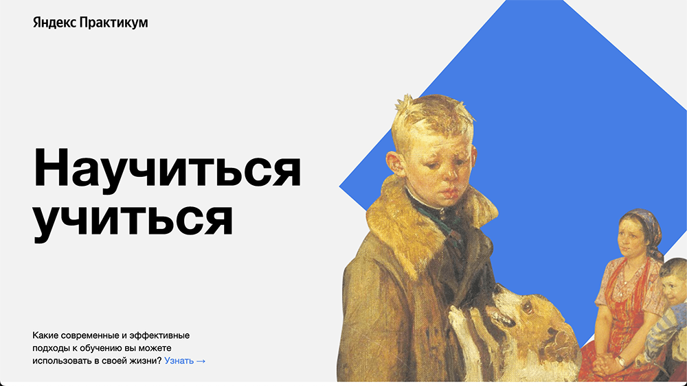

# Научиться учиться
(а так же, верстать сайты)

Перед вами моя первая проектная работа, она же, одностроничный сайт, она же лендинг, раскрывающий тему сложностей обучения.

На странице много интересных фактов о процессе обучения, а так же способов учиться вопреки этим сложностям!

## Какие техники применялись?
* Базовые HTML и CSS
* Организация проекта по БЭМ
* Анимация декоративных объектов через кейфреймы
* Встраивание видео-контента через iframe
* Flex-верстка
* Некоторые техники обучения из описанных на этом сайте ;)

## Что планирую доработать:
* По мере дальнейшего прохождения курса, повысить адаптивнсть
* Добавить интерактивности: с помощью JavaScript сделать скорость вращающихся объектов на заднике инертной. В процессе скролла скорость вращения увеличивается, при остановке - замедляется.
* Подключить другие шрифты
